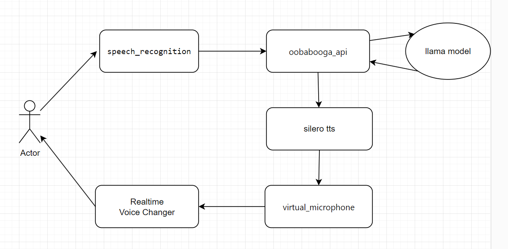
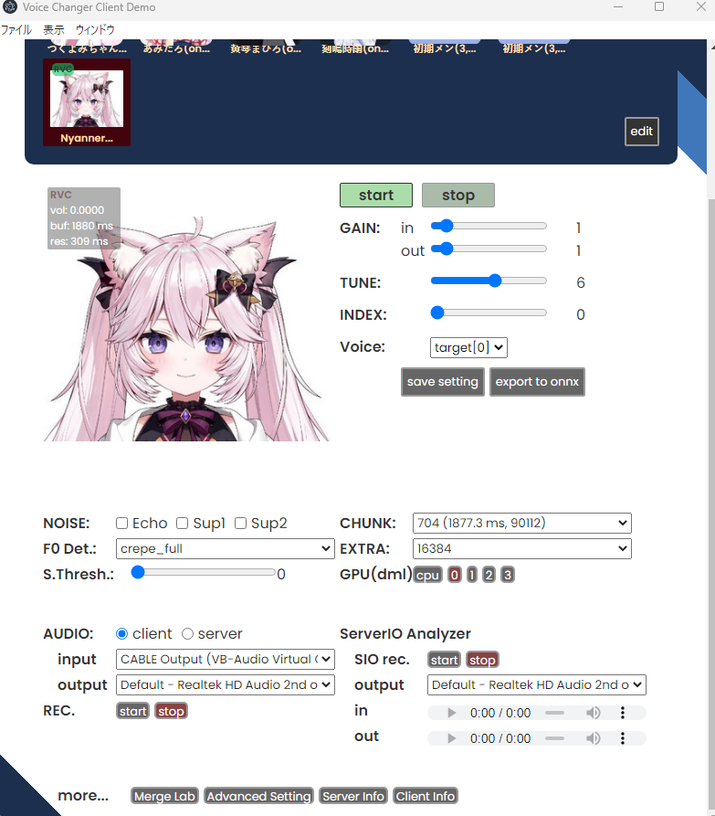

# llama_cute_voice_assistent

Disclaimer: This is a pre-alpha version.

Motivation: Many voice assistants with artificial intelligence have an unpleasant voice. While it may be a matter of personal preference. I aim to create a more human assistant that allows you to plug in cute anime character voices and vtuber voices.
<br>
<br>
<br>
Solution diagram:


<br>
<br>
# How to install

*This guide may not be the most detailed. It will need to be improved.*
<br>
<br>

## Step 1 - Install llama_cute_voice_assistent

*Installation procedure for Windows*

1) Install git https://git-scm.com/downloads
2) Install cudatoolkit (You should only choose versions of cuda that pytorch supports. See supported versions here https://pytorch.org/get-started/locally/) 
3) Install miniconda https://docs.conda.io/en/latest/miniconda.html
4) Open miniconda console
5) Create new conda environment

```
conda create --name llama_cute_voice_assistent python=3.11
```

6) Activate conda environment

```
conda activate llama_cute_voice_assistent
```

7) Clone project

```
git clone https://github.com/atomlayer/llama_cute_voice_assistent.git
```

8) Go to project directory

```
cd llama_cute_voice_assistent
```


9) Install pytorch 
- Go to https://pytorch.org/get-started/locally/
- Generate a command to install pytorch for your system (the command will be like this: pip3 install torch torchvision torchaudio --index-url https://download.pytorch.org/whl/cu118 )
- Execute the command

10) Install the libraries

```
pip install SpeechRecognition==3.10.0 
pip install pyttsx3==2.90 
pip install soundfile==0.12.1
pip install simpleaudio==1.0.4
pip install pygame==2.5.1
conda install PyAudio
pip install openai-whisper --no-cache-dir
pip install omegaconf==2.3.0
```
<br>
<br>


## Step 2 - Install oobabooga Text generation web UI

1) [https://github.com/oobabooga/text-generation-webui\#one-click-installers](https://github.com/oobabooga/text-generation-webui#one-click-installers)

2) Open the oobabooga Text Generation web UI using the **-api** parameter.

3) On the model tab: download and run your favorite AI model.

4) On the Chat settings \> Character tab: set your character name and description.
<br>
<br>

## Step 3 - Install Realtime Voice Changer

Detailed instruction - <https://www.youtube.com/watch?v=_JXbvSTGPoo>
<br>

1) Download https://huggingface.co/wok000/vcclient000/blob/main/MMVCServerSIO_win_onnxgpu-cuda_v.1.5.3.11.zip

2) Unpack the archive

3) Run start_http.bat

4) Join the AI Hub Discord: https://discord.gg/aihub

5) Go to the search-models channel

6) Find and download the model you like

7) Click the edit button in the Realtime Voice Changer Client

8) Upload the model to a free cell

9) Adjust the best TUNE parameter for your voice.
<br>
<br>

## Step 4 – Install the virtual microphone

1) Download and install VB-CABLE Virtual Audio Device <https://vb-audio.com/Cable/>

2) Open Realtime Voice Changer

3) Set up an audio input: Cable Output (VB-Audio Virtual Cable)



4) Press start button
<br>
<br>


## Step 5 - Change the settings in the settings.py file

1) Replace the wake words.
<br>
<br>

# How to use

1) Open conda console in the project folder
2) Run the command: 
```
python voice_chat.py
```
3) Say the wake word and the command for your assistant.


# Links
https://github.com/davabase/whisper_real_time